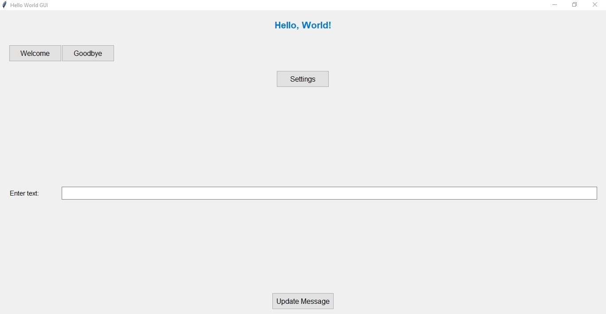
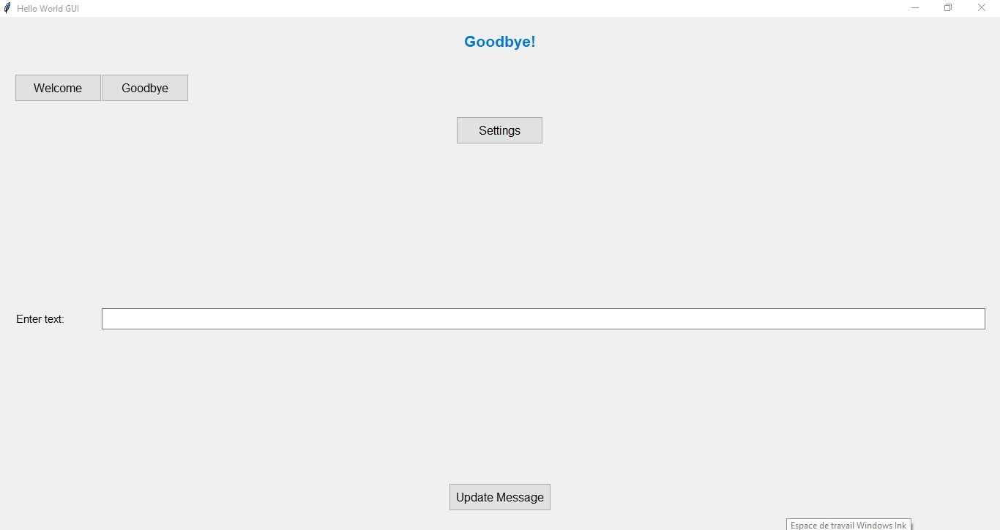
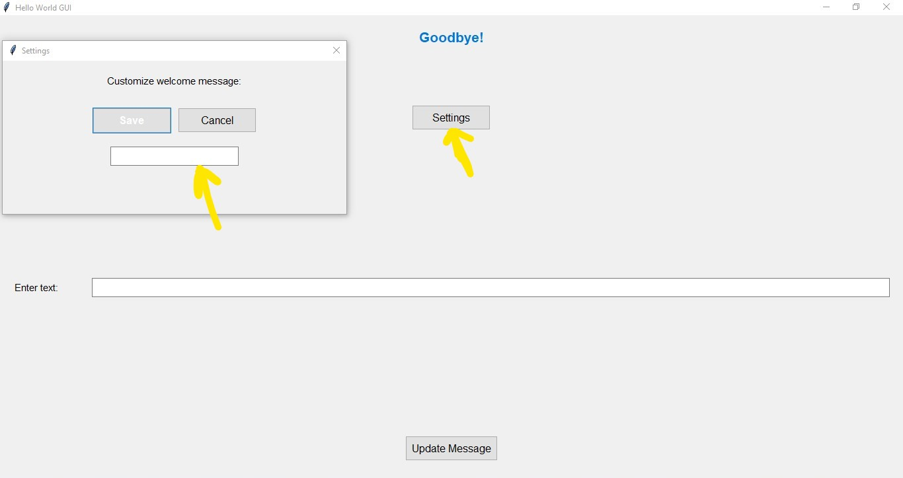
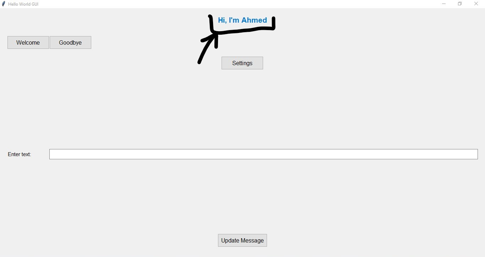
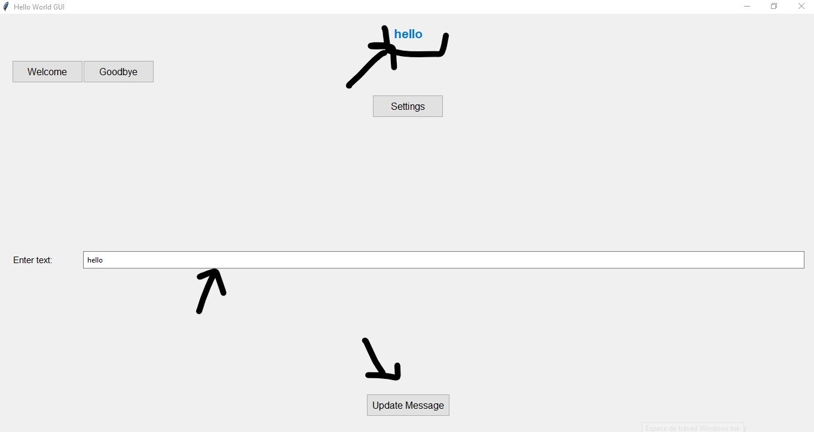

# Hello World GUI

[](https://www.python.org/)
[](https://opensource.org/licenses/MIT)
[](https://github.com/ahmedsabrari/hello_world_gui/actions)
[](https://github.com/psf/black)

A professional, extensible "Hello World" GUI application built with Python and Tkinter, featuring a clean separation between UI components and business logic.







## 📖 About The Project

Hello World GUI is a demonstration project showcasing best practices in Python GUI application development. It implements a clean architecture pattern with complete separation between the user interface and business logic, making it an excellent starting point for more complex Tkinter applications.

The application features a simple yet elegant interface with multiple interaction options, customizable messages, and a settings dialog. It serves as both a functional example and a template for building professional Python GUI applications.

### Key Features

- 🎨 Clean, modern GUI built with Tkinter
- 🧩 Modular architecture with separated UI and logic layers
- ⚙️ Customizable themes and styles
- 🔧 Extensible widget system
- 🧪 Comprehensive test suite
- 📦 Easy installation and packaging

## 🚀 Built With

-  - Primary programming language
-  - GUI framework
-  - Testing framework

يمكنك إضافة **Project Structure** في ملف الـ **README** في قسم مناسب، مثل أسفل قسم **Usage** أو **Installation**، حتى يسهل على المطورين والآخرين فهم بنية المشروع.

إليك المكان المثالي لإضافة **Project Structure** في الـ README:

## 🗂️ Project Structure

Here’s the structure of the project:

```

hello\_world\_gui/
│── README.md
│── requirements.txt
│── setup.py               # optional, for packaging
│── main.py                # entry point
│
├── gui/                   # user interface code
│   ├── **init**.py
│   ├── app.py             # main Tkinter App class
│   ├── widgets.py         # reusable widgets (buttons, labels, etc.)
│   └── styles.py          # colors, fonts, themes
│
├── logic/                 # business logic
│   ├── **init**.py
│   └── functions.py       # event handlers and app logic
│
├── assets/                # directory for assets like images
│   └── images/            # store images here
│       └── hello-world-screenshot.png  # image file
│
└── tests/                 # tests
├── **init**.py
└── test\_app.py

```

## 📋 Prerequisites

Before installing Hello World GUI, ensure you have the following prerequisites:

- Python 3.8 or higher
- pip (Python package installer)
- Git (for development version)

### Verifying Installation

```bash
# Check Python version
python --version

# Check pip version
pip --version

# Check Git version (optional)
git --version
```

## ⚙️ Installation

### Method 1: Install from GitHub (Recommended for Development)

```bash
# Clone the repository
git clone https://github.com/ahmedsabrari/hello_world_gui.git

# Navigate to the project directory
cd hello-world-gui

# Install in development mode
pip install -e .
```

### Method 2: Manual Installation

```bash
# Download the source code
# Extract the archive and navigate to the directory

# Install dependencies (if any)
pip install -r requirements.txt

# Run directly without installation
python main.py
```

## 🎯 Usage

### Starting the Application

```bash
# After installation, run the application
hello-world-gui

# Or run directly from the source
python main.py
```

### Basic Interactions

1. Click the "Greet" button to display a welcome message
2. Click the "Farewell" button to display a goodbye message
3. Use the text input field to customize the message
4. Click the "Settings" button to open the settings dialog

### Application Settings

The application can be configured through the settings dialog or by modifying the source code:

1. UI components - Modify `gui/app.py`
2. Business logic - Update `logic/functions.py`
3. Widget styles - Customize `gui/styles.py`

## 🧪 Testing

### Running Tests

```bash
# Run all tests
python -m unittest discover tests

# Run specific test file
python -m unittest tests/test_app.py

# Run with verbose output
python -m unittest discover tests -v
```

## 🗺️ Roadmap

### Planned Features
- [ ] Multi-language support
- [ ] Additional theme options
- [ ] Plugin system for extensibility
- [ ] Advanced settings persistence
- [ ] Additional widget types
- [ ] Cross-platform packaging improvements

### Future Enhancements
- [ ] Database integration examples
- [ ] Network functionality examples
- [ ] Async operations support
- [ ] Advanced theming engine
- [ ] Component library extensions

## ❓ FAQ

### Q: Why use this architecture for a simple Hello World app?
A: This architecture demonstrates best practices that scale to complex applications, making it an excellent learning resource and foundation for real-world projects.

### Q: Can I use this for commercial projects?
A: Yes, the MIT license allows use in commercial projects with proper attribution.

### Q: How do I add new widgets?
A: Add new widget creation functions in `gui/widgets.py` and import them where needed.

### Q: How can I customize the appearance?
A: Modify the styles in `gui/styles.py` or extend the style configuration system.

### Q: Is there support for other Python GUI frameworks?
A: Currently, the project focuses on Tkinter, but the architecture could be adapted to other frameworks like PyQt or Kivy.

## 🙏 Acknowledgments

- Python Software Foundation for the excellent Python language
- The Tkinter community for documentation and examples
- Contributors who help improve this project

---

<div style="text-align: center; margin-top: 50px; font-family: 'Arial', sans-serif;">
  <p style="font-size: 14px; color: #777;">Made with ❤️ by</p>
  <a href="https://github.com/ahmedsabrari" 
     style="font-size: 18px; font-weight: bold; color: #0078D7; text-decoration: none;">
     ahmedsabrari
  </a>
  <p style="font-size: 12px; color: #777;">© 2025 All rights reserved</p>
</div>